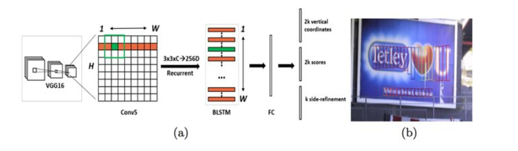
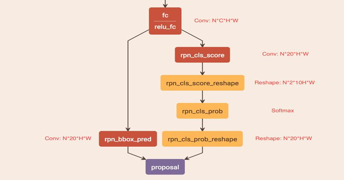
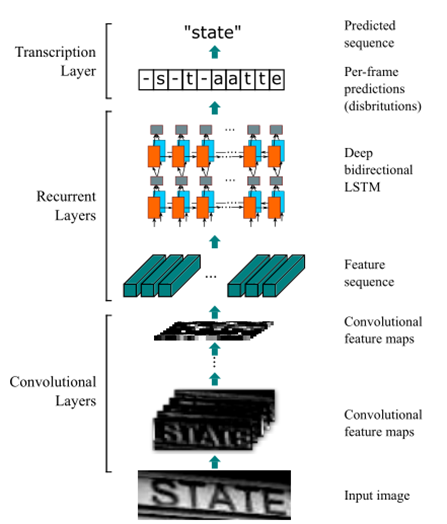
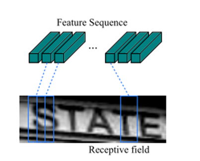
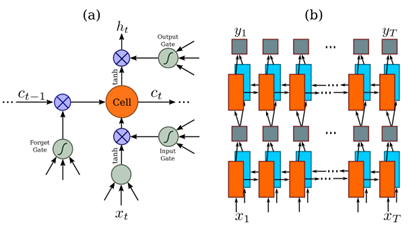
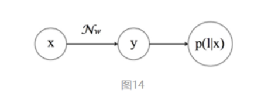
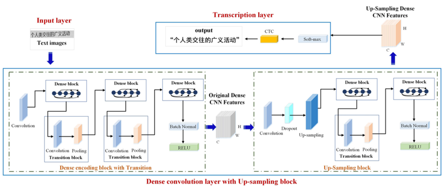

## lzu人工智能综合实践课程设计2022

**作者：孙锐、李沛霖、魏楚扬**

基于Tensorflow和Keras实现端到端的不定长中文字符检测和识别

* 文本检测：CTPN
* 文本识别：DenseNet + CTC

基于Tensorflow和pyttsx3实现机器翻译和文本转语音输出

- 机器翻译：Transformer
- 语音输出：pyttsx3

## 环境部署
``` Bash
sh setup.sh
```
* 注：CPU环境执行前需注释掉for gpu部分，并解开for cpu部分的注释

## 模型训练---文字检测和文本识别

### CTPN训练
详见ctpn/README.md

### DenseNet + CTC训练

#### 1. 数据准备

数据集：https://pan.baidu.com/s/1QkI7kjah8SPHwOQ40rS1Pw (密码：lu7m)
* 共约364万张图片，按照99:1划分成训练集和验证集
* 数据利用中文语料库（新闻 + 文言文），通过字体、大小、灰度、模糊、透视、拉伸等变化随机生成
* 包含汉字、英文字母、数字和标点共5990个字符
* 每个样本固定10个字符，字符随机截取自语料库中的句子
* 图片分辨率统一为280x32

图片解压后放置到train/images目录下，描述文件放到train目录下

#### 2. 训练

``` Bash
cd train
python train.py
```

#### 3. 结果

| val acc | predict | model |
| -----------| ---------- | -----------|
| 0.983 | 8ms | 18.9MB |

* GPU: GTX TITAN X
* Keras Backend: Tensorflow

#### 4. 生成自己的样本

可参考[SynthText_Chinese_version](https://github.com/JarveeLee/SynthText_Chinese_version)，[TextRecognitionDataGenerator](https://github.com/Belval/TextRecognitionDataGenerator)和[text_renderer](https://github.com/Sanster/text_renderer)

## 机器翻译

翻译部分的训练因为数据集过大，而我们算力有限。故使用基于hugging团队预训练的模型进行处理数据。

数据：opus  访问链接：https://opus.nlpl.eu/

- 25种语音平行语料库
- 预训练模型：hugging face  https://huggingface.co/

## 项目快速复现d

将测试图片放入test_images目录，检测结果会保存到test_result中

``` Bash
python orc_translate_play.py
```

这一文件中将所有功能集成在一起，并将结果输出在res.txt文件中。

## 项目原理部分

**1、文字检测-CTPN**

**1.1、CTPN网络结构**



输入N副Images：

- 首先VGG提取特征，获得大小为$N * C * H * W $的conv5 feature map

- 之后在conv5上做$ 3 * 3$的滑动窗口，即每个点都结合周围$ 3 * 3 $区域特征获得一个长度为$ 3 * 3 * C$的特征向量。*

  输出为$N * 9 C * H * W $的feature_map，该特征 显然只有CNN学习到的空间特征。

- 再将这个feature map进行Reshape为以下维度:
  $$\text { Reshape: } N \times 9 C \times H \times W \rightarrow(N H) \times W \times 9 C$$

- 然后以$Batch=NH$且最大时间长度$T_max=W$的数据流输入双向LSTM，学习每一行的序列特征。双向LSTM输出，再经Reshape恢复形状：
  $$\text { Reshape: }(N H) \times W \times 256 \rightarrow N \times 256 \times H \times W$$
  此时该特征既包含空间特征，也包含了LSTM学习到的序列特征。

- 然后经过“FC”全连接层，变为$ N * 512 * H * W $的特征

- 最后经过类似Faster R-CNN的RPN网络，得到三个输出：2k个垂直坐标系（矩形框的中心位置和高度）、2k个score（text和non-text各有一个分数）、k个side-refinement（用于精修文本行的两个端点，表示每个proposal的水平平移量），得到text proposals。

- **CTPN通过CNN与BLSTM学到一组“空间+序列”的特征后，经过全连接层后得到一个512维的feature map，再接入RPN网络**

  

  **RPN网络结构**

  - 左边分支用于bounding box regression。由于fc feature map每个点配备了10个Anchor，同时只回归中心y坐标与高度2个值，所以为20个channels
  - 右边分支利用Softmax分类Anchor（有文本-无文本）

**1.2、竖直Anchor定位文字位置**

CTPN针对于横向排列的文字检测，所以采用一组（10个）等宽度的Anchors用于定位文字位置。
$$\text { widths }=[16] $$
$$\text { heights }=[11,16,23,33,48,68,97,139,198,283]$$
这样设置的目的：

- 保证在x方向上，Anchor覆盖原图每个点且不相互重叠。

- 不同文本在y方向上高度差距很大，所以设置Anchors高度为11-283（相差0.7倍），用于覆盖不同高度的文本目标。

获得Anchor后，CTPN会继续如下处理：

- Softmax判断Anchor中是否包含文本，即选出Softmax score大的正Anchor（score >0.7）。

- Bounding box regression修正包含文本的Anchor的中心y坐标与高度

**1.3、文本线构造算法**

经过前面的步骤，得到一串或多串text proposal，接下来采用文本线构造法，将其连接成一个文本检测框：

1.按照水平x坐标排序Anchor

2.按照规则依次计算每个检测框对，组成$pair(x_i,x_j)$

3.通过$pair(x_i,x_j)$建立一个Connect graph，最终获得文本检测框。


**2、文本识别-CRNN+CTC**

识别部分我们选用了DenseNet模型来实现，又采用了CTC的一种对齐算法



**2.1、使用CNN网络提取序列特征**

这一部分，我们使用最常见CNN网络来提取出图像中的序列特征，然后将这部分的输出信息保存并传进RNN网络进行预测



需要注意的是：每一列的特征宽度是固定的，这样就能保证特征的序列顺序不变，这也为接下来RNN的输入作出了准备。

**2.2、对特征序列进行逐帧预测**

这一部分主要是采用RNN网络处理序列信息，因为我们的文本也是一种序列，使用RNN最为合适。而为了解决一些RNN固有的缺陷问题比如梯度消失现象等等，我们采用一种种变种形式-----RCNN



RCNN：论文中采用的循环神经网络为BiLSTM，通过长短期记忆消除RNN产生的梯度消失问题。

**2.3、CTC：训练样本无需对齐的损失计算方法**

我们知道对于RNN，如果使用常见的Softmax 交叉熵损失，则每一列输出都需要对应一个字符元素。那么训练时候每张样本图片都需要标记出每个字符在图片中的位置，再通过CNN感受野对齐到特征图的每一列获取该列输出对应的Label才能进行训练

•解决策略: CTC

我们的主要目的就是用循环神经网络标记无分段序列数据，引入blank字符，解决有些位置没有字符的问题

通过递推，快速计算梯度。这样模型可以判断出连续字符的使用。就比如
$$B\left(\pi_{1}\right)=B(--s t t a-t--e)=\text { state } $$
$$B\left(\pi_{2}\right)=B(s s t-a a a-t e e-)=\text { state } $$
$$B\left(\pi_{5}\right)=B(-s t a-a t t e-e-)=\text { staatee }$$
简单来说就是遵循原则

- 一是空格前后要隔开，

- 无空格两个单词一样要合并。

****

**CTC的训练过程**，本质上是通过梯度 $\frac{\partial p(l \mid x)}{\partial w}$ 调整LSTM的参数 $w$ ，使得对于输入样本为 $\pi \in B^{-1}(l)$ 时使得 $p(l \mid x)$ 取得最大。



现在我们要做的事情就是: 通过梯度 $\frac{\partial p(l\mid x)}{\partial w}$ 调整LSTM的参数w ，使得对于输入样本为$\pi \in B^{-1}(z)$ 时有 $p(l \mid x)$取得最大。**所以如何计算梯度才是核心。**
单独来看CTC输入 (即LSTM输出) $y$ 矩阵中的某一个值 $y_{k}^{t}$ (注意 $y_{k}^{t}$ 与 $y_{l_{k}}^{t}$ 含义相同，都是 在 $t$ 时 $\pi_{t}=l_{k}$ 的概率) :

$$\frac{\partial p(l \mid x)}{\partial y_{k}^{t}}=\frac{\partial \sum_{\pi \in B^{-1}(l), \pi_{t}=l_{k}} \frac{\alpha_{t}\left(l_{k}\right)\beta_{t}\left(l_{k}\right)}{y_{l_{k}}^{t}}}{\partial y_{l_{k}}^{t}}=-\frac{\sum_{\pi \in B^{-1}(l), \pi_{t}=l_{k}}\alpha_{t}\left(l_{k}\right) \beta_{t}\left(l_{k}\right)}{\left(y_{l_{k}}^{t}\right)^{2}}$$

上式中的 $\alpha_{t}\left(l_{k}\right) \beta_{t}\left(l_{k}\right)$ 是通过递推计算的常数，任何时候都可以通过递推快速获得，那么即可 快速计算梯度 $\frac{\partial p(l \mid x)}{\partial y_{k}^{t}}$ ，之后按照梯度训练即可。


在我们任务种我们使用DenseNet作为基础网络****Dense convolution layer with Up-Sampling block

1. 首先通过dense block提取原始密集CNN特征

2. 利用上采样模块优化密集编码块（修复丢失特征）

3. 转录层先通过softmax对上采样特征预测，再通过CTC转化为标签



**3、机器翻译--Transformer**

在结束文本检测和识别任务之后，我们将模型输出结果保存下来实现机器翻译。而我们的翻译模型选用的是语言建模领域比较经典的transformer模型，下面我们简单介绍以下这一模型。模型简单图示如下：


**模块1、Positional Embedding**

模块的主要做用是把位置信息加入到输入向量中，使模型知道每个字的位置信息。

**模块2、Multi-Head Attention**

这里我们看看multi-head attention中的 multi-head是什么意思。我们假设 $d_{\text {model }}=512, h=8(8$ 个头) , 说下transformer中是怎么 处理的:
前面我们说过了， $Q 、 K 、 V$ 三个矩阵是encoder的输入经过三个linear映射而成，它们的大小是 $[B, L, D]$ (batch size, max sentence length, embedding size), 这里为了说的清楚些，我们暂时不看 $[B]$ 这个维度。那么 $Q 、 K 、 V$ 的维度都为 $[L, D]$ ， multi-head就 是在 $[D]$ 维度上对数据进行切割，把数据切成等长的 $8 \mathrm{c}_{殳}(h=8)$ ，这样 $Q 、 K 、 V$ 均被切成等长的 8 段，然后对应的 $Q 、 K 、 V$ 子段组 成一组，每组通过 Scaled Dot-Product Attention 算法 计算出结果，这样的结果我们会得到8个，然后把这8个结果再拼成一个结果，就 multi-head的结果。具体过程如下图:


**模块3、ADD**

此模块做了个类似残差的操作，具体操作就是把模块2的输入矩阵与模块2的输入矩阵的对应位置做加法运算。

**模块4、Layer Normalization**

不论是layer normalization $Q$ 还是batch normalization，其实做的都是一件事情，都是根据 $x=a * \frac{x-\bar{x}}{s t d+e p s}+b$ 对 $x$ 的分布进行调整。不同的是 $\bar{x}$ 和 $s t d$ 的计算方式不同。如下图:


batch normalization的和std是延粉色方向计算的，而layer normalization是延蓝色方向计算的。如果兄弟们去面试，可能面试官会 问为什么这里没有使用BN，而使用了LN,我的理解是，BN对batch size的大小是有要求的，一般batch size越大，计算出的 $\bar{x}$ 越好，而我用 12G内存的GPU，跑transformer的模型时，batch size最多也就设置到32。batch size还是偏小的。所以使用与batch size无关的layer normlization。从另一个角度讲，batch size之所以小，是因为我们的embedding size 大，而layer normalization 正好是延这个方向做的， 所以正好使得layer normalizationi算的更稳定。

**模块5、Feed Forward NetWork**

Feed Forward NetWork 翻译成中文叫 前馈网络，其实就是MLP。我们这里不纠结于FFN的定义，我们直接看下transformer里是怎么实现的。如下图，我们先把输入向量从512维$d_{model}$映射到2048维，然后再映射到512维。实现时，就是使用两个linear层，第一个linear的输入是512维，输出是2048维，第二个linear的输入是2048，输出是512。


**模块6、Masked Multi-Head Attention**

文已讲了Multi-Head Attention，而且在讲 Scaled Dot-Product Attention 时也讲了mask机制，此模块的区别在于maked的策略不同，在encoder中我们是把padding给masked掉，这里我们除了要考虑padding,还要考虑预测时的未来变量问题，换句话说，我们是用一句话中的前$N-1$ 个字预测第$N$个字，那么我们在预测第$N$个字时，就不能让模型看到第N个字之后的信息，所以这里们把预测第$N $个字时，第$N$包括)个字之后的字都masked掉。我们假设预测序列为’i like this apple’，则我们要做如下的mask(粉色的0实际上是没有的，这里表示对应的位置为pad的值)


**模块7、Multi-Head Attention**

模块7 与上文模块2（encoder 中 的 Multi-Head Attention） 代码实现上完全相同，区别在于模块2 只有一个输入，模块2把此输入经过三个linear映射成Q、K、V ，而模块7的输入有两个，一个是decoder的输入经过第一个大模块传过来的值（为了方便，我们叫它input_x），一个是encoder最终结果（我们暂叫它input_memory）, 模块7是把input_x通过一个linear映射成了Q，然后通过两个linear把input_memory映射成K、V ,其它的与模块2完全一致。

**模块8、Linear**

此模块的目的是把模型中transformer decoder的输出从$d_{model}$维度映射到词表大小的维度。linear本身也比较简单，这里不再细讲了。


**模块9、SoftMax**

此模块会把上层linear的输出转化成概率，对应到某个字的概率


实际使用中我们在编解码器部分并不是使用单一的上述架构，而是选用6个编码器构成一个编码栈(encode stack)，用六个解码器作为解码栈来实现翻译模型。


**4、语音输出**

我们选用**pyttsx3**作为我们语音输出的工具，这是一个可以离线使用的python开源库，我们只需要使用pip命令安装对应库文件即可。

`pip install pyttsx3`

**优势**

- 完全离线文字到语音转换
- 可以选择不同的声音系统进行输出
- 可以控制语音输出的速度和音量
- 可以保存语音文件，使用简便


**项目整合**

我们运行ocr_translate_play.py，是将我们指定文件夹 **test_images**下面所有图片进行ocr识别，我们将每张图片的识别结果保存为字符串形式写进res.txt。而后我们将结果再传入我们预训练好的transformer模型，实现法语、英语、德语的输出。并分别将这部分输出追加到res.txt。


我们的所有项目均已经开源并部署在**https://github.com/Tender-sun/ocr_translate_play-master**
